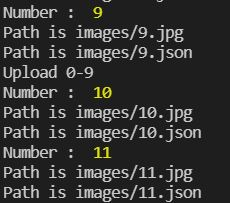
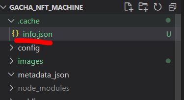
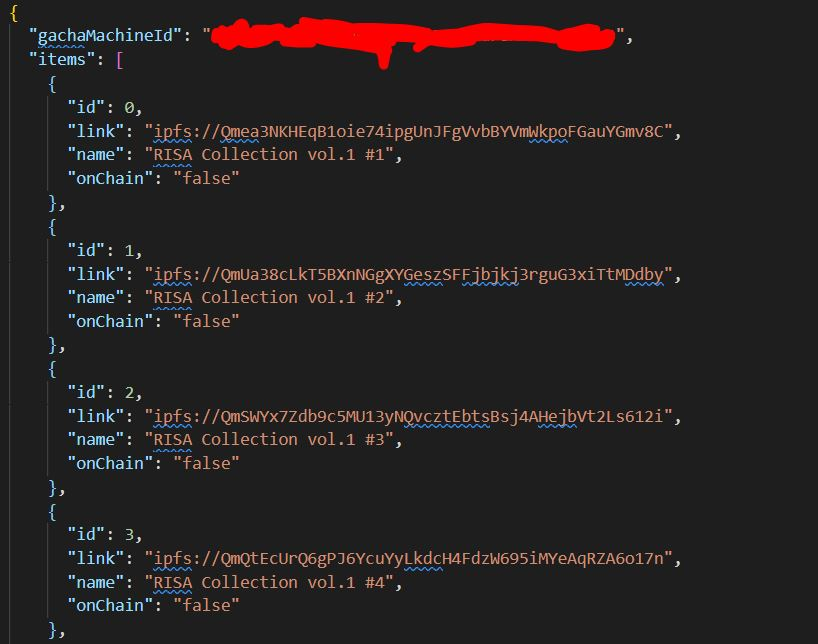
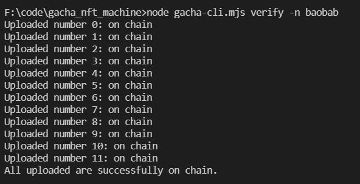

# Pinata IPFS를 사용한 방법

## Pinata IPFS를 통해 이미지와 메타데이터를 업로드하는 경우

이미지와 메타데이터를 모두 Pinata IPFS에 업로드하는 경우, 다음과 같은 명령어를 통해 이미지와 메타데이터를 Pianata IPFS에 업로드하고, tokenURI를 스마트컨트랙트에 업로드합니다.

```
node gacha-cli.mjs upload <폴더명> -n <네트워크명> -i

ex) node gacha-cli.mjs upload images -n baobab -i
ex2) node gacha-cli.mjs upload images -n mainnet -i
```




업로드가 완료되면, 프로젝트 폴더 내의 .cache폴더가 생성되고, .cache폴더 내 info.json 파일이 생성됩니다.






해당 info.json은 프로젝트의 업로드의 캐시파일이며, 각 파일들이 업로드될 때마다 각 NFT의 tokenURI를 저장합니다. 업로드가 중간에 끊기거나, 제대로 업로드가 되지 않은 경우에는 다시 upload 명령어를 입력하여 끊긴 시점부터 다시 업로드를 진행할 수 있습니다.

info.json의 내용을 보면 onChain의 값이 false가 되어있는데, 업로드가 끝나면 다음과 같이 verify 명령어를 통해 업로드가 제대로 되었는지 확인하는 과정이 필요합니다.

```
node gacha-cli.mjs verify -n <네트워크명>

ex) node gacha-cli.mjs verify -n baobab
```



verify가 완료되면, 다음과 같이 info.json의 각 NFT들의 onChain값이 true로 바뀝니다. false인 값은 제대로 업로드가 되지 않은 항목이니 다시 upload 명령어를 입력하시고, verify를 해주시면 됩니다.


