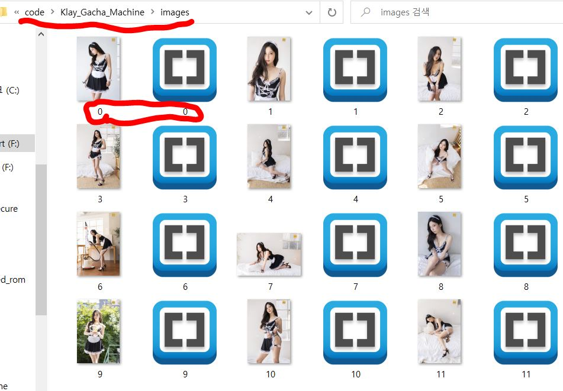

# 이미지, 메타데이터 옮기기

준비해두신 Image파일과 json 파일들을 한 폴더 안에 옮기신 다음, 해당 폴더를 프로젝트 폴더 내로 이동시킵니다.

### 파일명과 관련해 필수적으로 지켜야 할 사항&#x20;

#### 반드시 \[이미지파일, json파일]은 각 번호로 매칭시켜둬야 합니다. ex) 0.png, 0.json, 1.png, 1.json&#x20;

#### 반드시 파일은 0으로 시작해야 합니다. ex)총 1만개라면 0.png\~9999.png, 0.json\~9999.json&#x20;

#### 이미지파일, json파일은 꼭 연속된 번호로 되어있어야 합니다.
