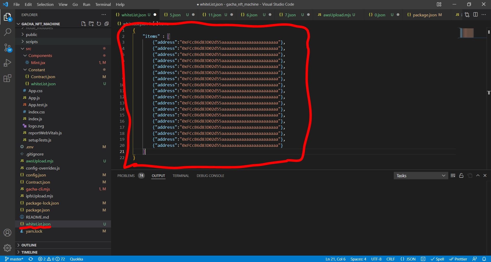
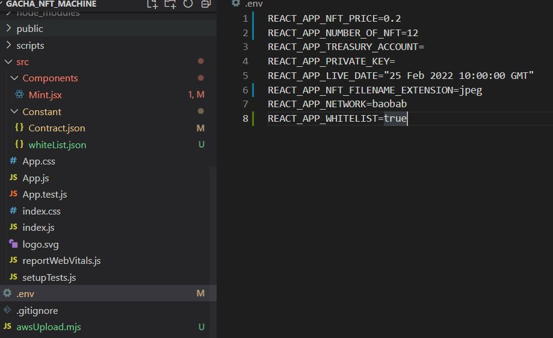

# 화이트리스트 적용

프로젝트 폴더 내 whiteList.json 파일에 화이트리스트 대상 주소를 입력합니다.



화이트리스트는 json 형식으로 다음과 같이 작성해주셔야 합니다.

```
{
    "items" : [
        {"address":"0xFCcB6d83D02d55aaaaaaaaaaaaaaaaaaaaaaa"},
        {"address":"0xFCcB6d83D02d55aaaaaaaaaaaaaaaaaaaaaaa"},
        {"address":"0xFCcB6d83D02d55aaaaaaaaaaaaaaaaaaaaaaa"},
        {"address":"0xFCcB6d83D02d55aaaaaaaaaaaaaaaaaaaaaaa"},
        {"address":"0xFCcB6d83D02d55aaaaaaaaaaaaaaaaaaaaaaa"},
        {"address":"0xFCcB6d83D02d55aaaaaaaaaaaaaaaaaaaaaaa"},
        {"address":"0xFCcB6d83D02d55aaaaaaaaaaaaaaaaaaaaaaa"},
        {"address":"0xFCcB6d83D02d55aaaaaaaaaaaaaaaaaaaaaaa"},
        {"address":"0xFCcB6d83D02d55aaaaaaaaaaaaaaaaaaaaaaa"},
        {"address":"0xFCcB6d83D02d55aaaaaaaaaaaaaaaaaaaaaaa"},
        {"address":"0xFCcB6d83D02d55aaaaaaaaaaaaaaaaaaaaaaa"},
        {"address":"0xFCcB6d83D02d55aaaaaaaaaaaaaaaaaaaaaaa"},
        {"address":"0xFCcB6d83D02d55aaaaaaaaaaaaaaaaaaaaaaa"},
        {"address":"0xFCcB6d83D02d55aaaaaaaaaaaaaaaaaaaaaaa"},
        {"address":"0xFCcB6d83D02d55aaaaaaaaaaaaaaaaaaaaaaa"},
        {"address":"0xFCcB6d83D02d55aaaaaaaaaaaaaaaaaaaaaaa"},
        {"address":"0xFCcB6d83D02d55aaaaaaaaaaaaaaaaaaaaaaa"},
        {"address":"0xFCcB6d83D02d55aaaaaaaaaaaaaaaaaaaaaaa"}
    ]
}
```

화이트리스트 명단이 작성되면, 다음의 명령어를 통해 화이트리스트를 업데이트합니다.


```
node gacha-cli.mjs applyWhiteList
```

화이트리스트 업로드가 완료되면, Mint UI에서의 화이트리스트 적용을 위해 .env파일의 화이트리스트 항목을 "true"로 바꿔줍니다.



설정이 완료되면 Mint UI에 화이트리스트가 적용이 되고, 민팅 대상이 아닌 주소는 민팅이 불가능합니다.&#x20;

<mark style="color:red;">**화이트리스트를 전체 물량의 일부만 적용하실 경우(예를 들어, 1만개 민팅물량 중 1천개를 적용하실 경우), 화이트리스트 민팅 일자에 배포하실 때에는 .env파일의 총 물량항목을 해당 일부물량(예를 들어, 1만개가 아니라 1000으로 입력)만 입력하시면 총 1천개만 발행이 됩니다. 이후 퍼블릭 세일에는 총 물량을 다시 전체 물량(예를 들어, 1만개 전체)을 입력하시고, 화이트리스트 항목을 "false"로 입력하신 뒤 배포하시면 됩니다.**</mark>
