# AWS S3 api key 가져오기

리빌(reveal)용이나 브리딩 시스템(breeding system)을 구상하고 있는 NFT 발행인은 AWS S3 스토리지를 이용해 NFT를 발행할 수 있습니다. 먼저 AWS(amazon web service)에 접속해 계정을 발행합니다.

[https://aws.amazon.com/ko/](https://aws.amazon.com/ko/)

.png>)

계정 접속 후 콘솔로 접속합니다.

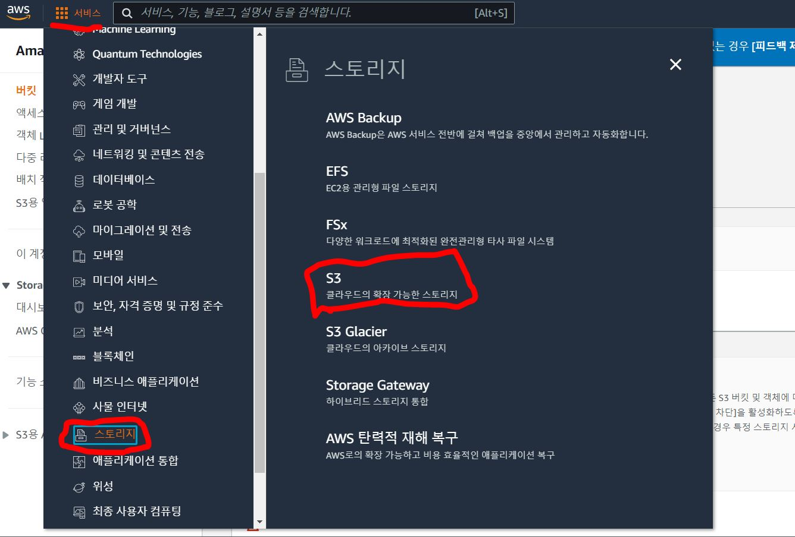

좌측 상단의 서비스목록을 클릭하고, 스토리지 서비스탭의 S3항목으로 들어갑니다.

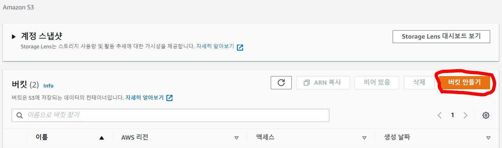

S3항목에 접속한 뒤, 우측의 버킷 만들기를 클릭합니다.

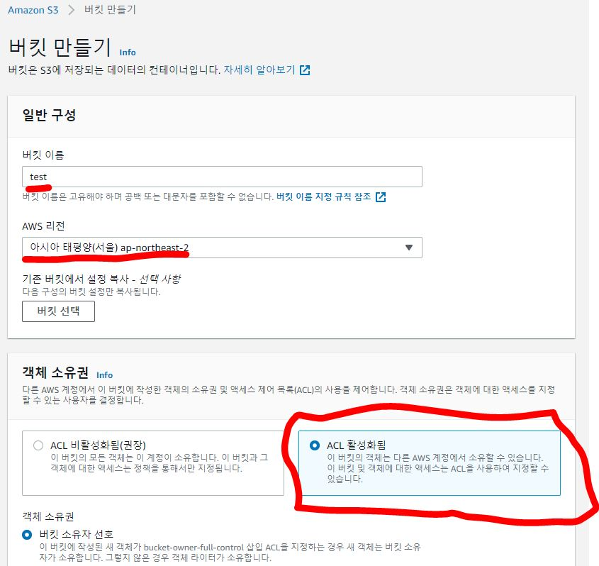

버킷 이름을 입력하고, 리전을 선택합니다. 그리고 객체 소유권의 "ACL 활성화됨"을 클릭합니다.

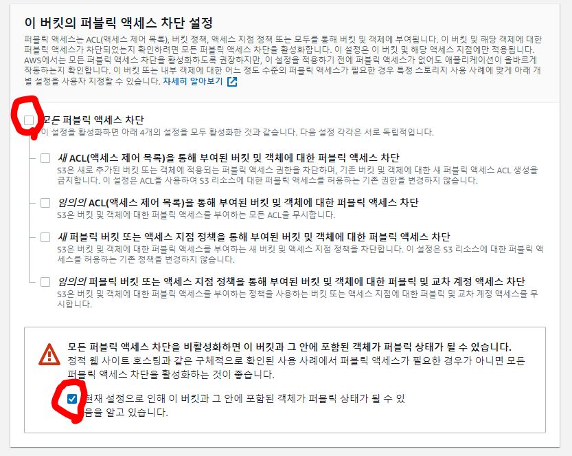

아래의 "모든 퍼블릭 액세스 차단"의 체크박스를 해제하고, 아래에 있는 "현재 설정으로 인해..."부분의 체크박스를 체크합니다.

버킷 만들기를 클릭해 버킷을 만듭니다.

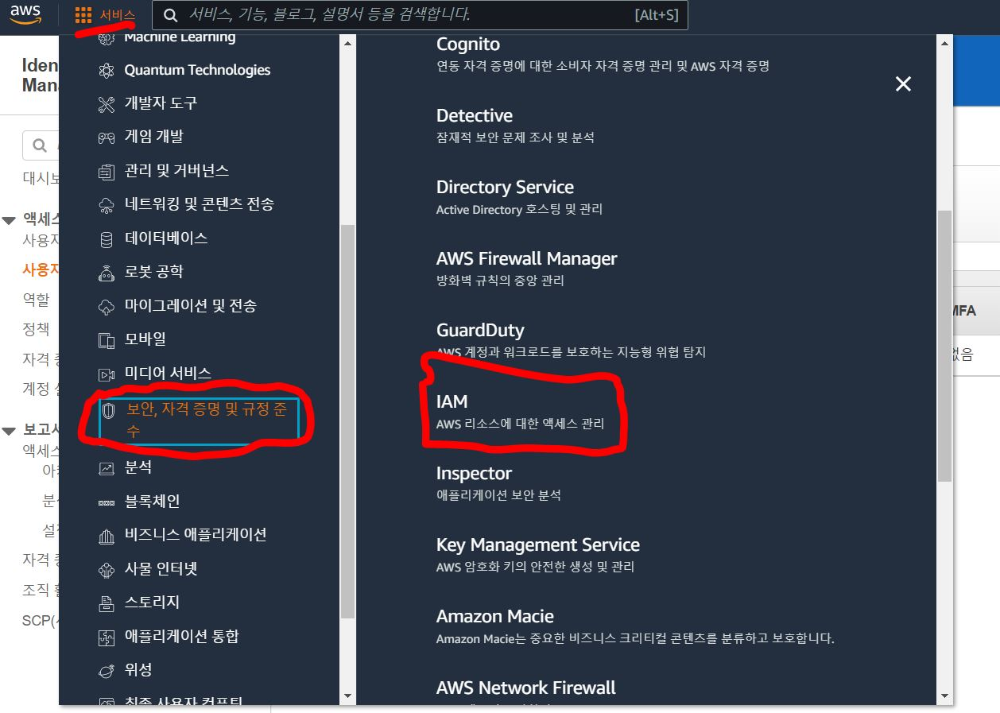

버킷이 생성되었으면, 다시 서비스목록에서 "보안, 자격 증명 및 규정 준수"항목을 클릭하고 우측의 IAM 서비스 항목으로 들어갑니다.

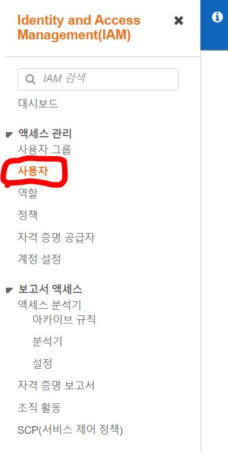

IAM 서비스에 들어가시면, 좌측의 "사용자"탭을 클릭합니다.

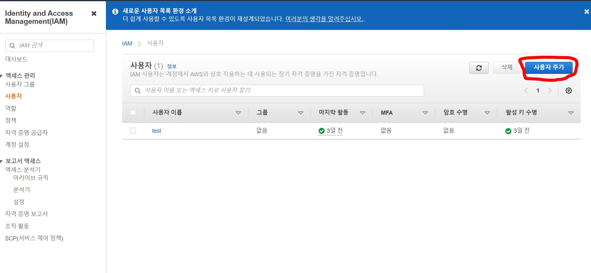

우측의 "사용자 추가"를 클릭합니다.

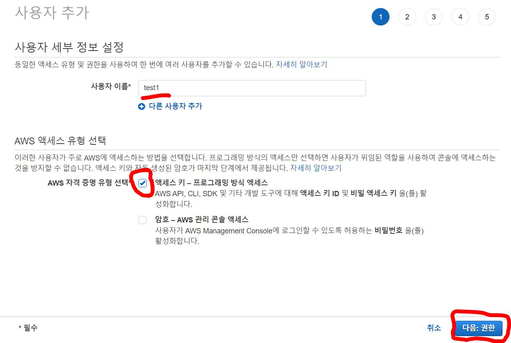

사용자 이름을 입력하고, 중간의 AWS 액세스 유형 선택항목에서 "액세스 키 - 프로그래밍 방식 액세스"를 체크하고 다음 버튼을 클릭합니다.

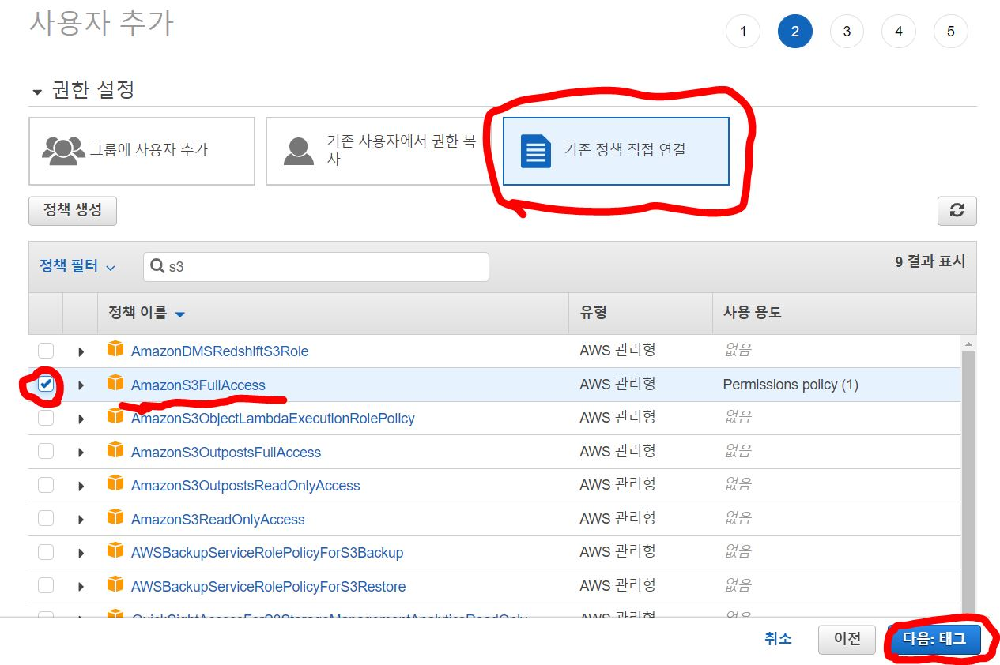

권한 설정에서 "기존 정책 연결"을 클릭하시고, 정책 필터 내에서 "AmazonS3FullAccess"를 체크하신 뒤, 다음으로 이동합니다. 태그는 입력하지 않고 그대로 다음 항목으로 넘어오시면 됩니다.

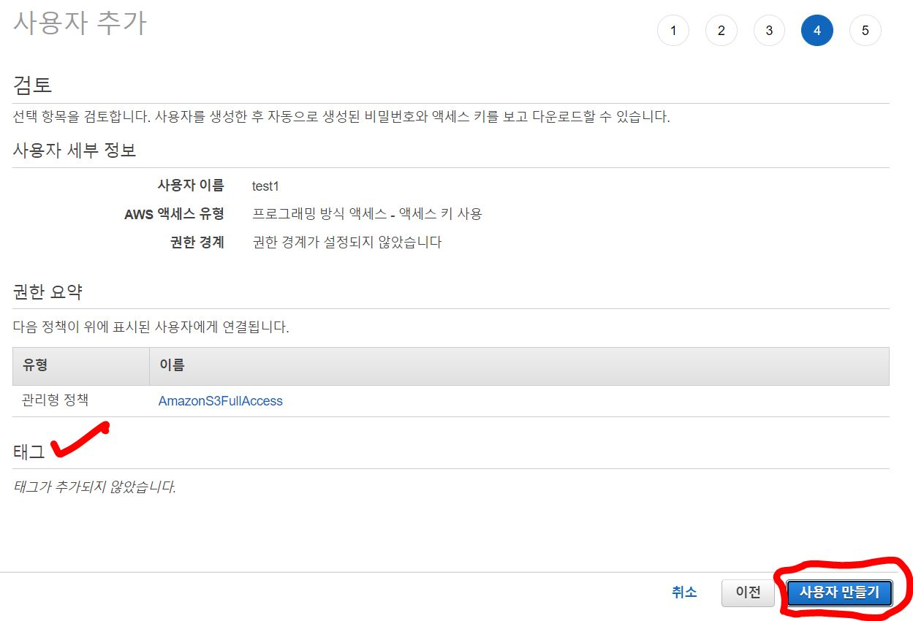

태그는 추가하지 않으셔도 됩니다. 사용자 만들기 버튼을 클릭해 사용자를 만듭니다.

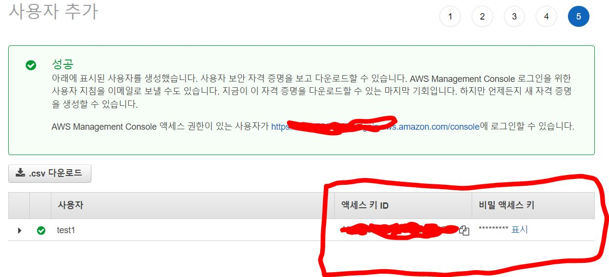

사용자가 추가되면, 중간에 있는 "액세스 키 ID"와 "비밀 액세스 키"를 복사해두시면 됩니다. 비밀 액세스 키는 "표시"를 클릭해 따로 복사해두셔야 합니다. 이 두가지 키와 버킷의 이름, 리전을 이용해 Gacha-CLI가 AWS S3 버킷으로 접근합니다.
