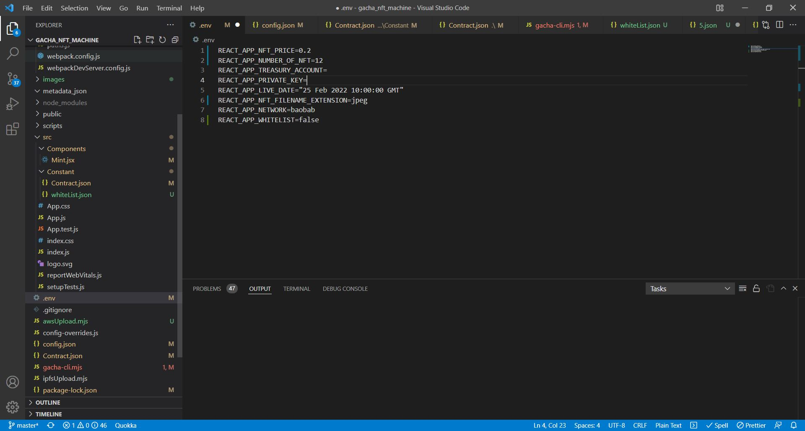

# Mint UI 환경파일 설정

프로젝트 내 .env파일을 열면 다음과 같은 내용이 나옵니다. (.env파일이 없는 경우, 파일 이름을 '.env'로 새로 만들어주세요)



```
REACT_APP_NFT_PRICE=0.2 //민팅 가격(0.1Klay 이상으로 설정하셔야 합니다)
REACT_APP_NUMBER_OF_NFT=12 //총 발행량 or 회당 발행량(화이트리스트의 경우)
REACT_APP_TREASURY_ACCOUNT= //NFT 발행 주소
REACT_APP_PRIVATE_KEY= //NFT 발행 주소의 프라이빗 키
REACT_APP_LIVE_DATE="25 Feb 2022 10:00:00 GMT" // NFT 발행을 시작할 날짜
REACT_APP_NFT_FILENAME_EXTENSION=jpeg //NFT 이미지의 형식
REACT_APP_NETWORK=baobab //네트워크명 baobab or mainnet
REACT_APP_WHITELIST=false //화이트리스트 사용 여부
```
