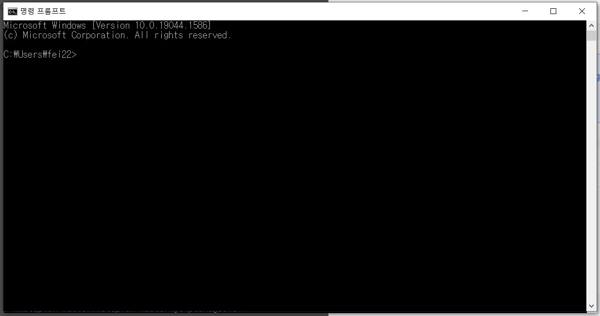
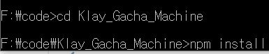

# Klay-Gacha-Machine 설치하기

## git clone을 이용한 설치

명령 프롬프트를 켜고 다음 명령어를 입력합니다.   &#x20;

&#x20;`git clone https://github.com/Planet-Us/Klay_Gacha_Machine.git`

&#x20;`cd Klay_Gacha-Machine`

&#x20;`npm install`

``

## 프로젝트를 직접 다운로드해 설치

다음 링크로 접속해 코드를 다운받습니다.



&#x20;다운받은 파일의 압축을 풀고, 해당 폴더 내에서 명령어 프롬프트를 켜고 다음 명령어를 입력합니다.

`npm install`

npm install을 통해 프로젝트에 필요한 의존 모듈을 설치할 수 있습니다. 이 과정은 몇분가량 소요됩니다.
